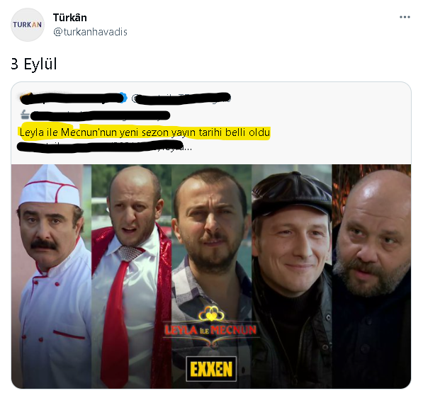
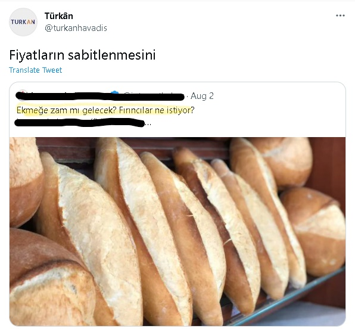
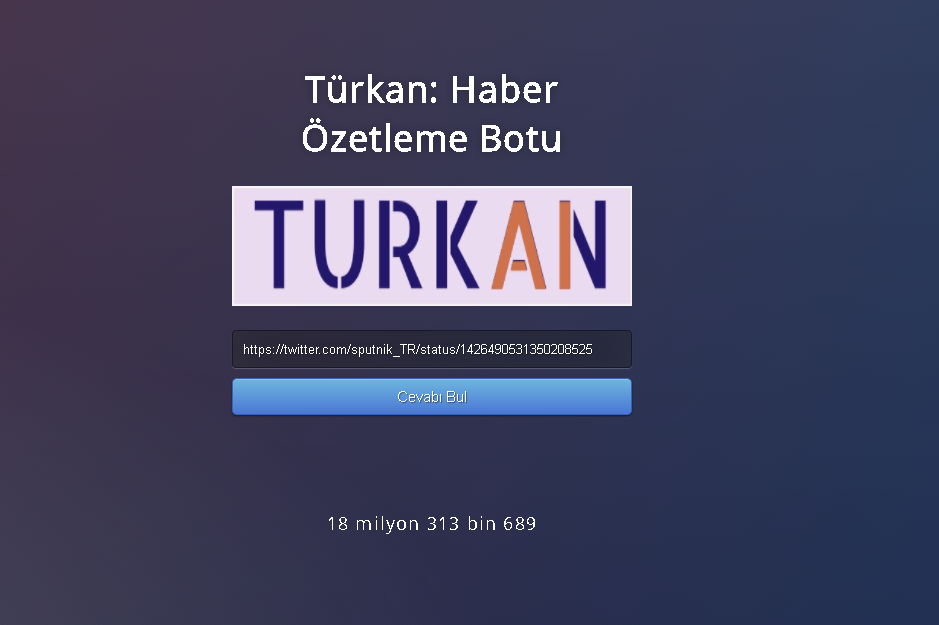

<p align="center">
  
</p>

**Türkan, Twitter üzerinde haber sitelerinin gizemli haberlerini(!) okuyup, alıntılayarak haberin cevabını tweet atan bir Twitter botudur.**

### Requirements

```
newspaper3k==0.2.8
Flask==1.1.1
numpy==1.20.2
transformers==4.9.2
tweepy==3.10.0
gunicorn == 20.1.0
fasttext
```

### Örnek

Aşağıdaki tweet örnek olarak verilebilir. X haber sitenin paylaşmış olduğu haberde Leyla ile Mecnun'nun yeni sezon yayın tarihinin belli olduğunu ama hangi tarihte olduğu söylememiş. Bu tarz haberleri Türkan, sizler için okuyup cevabı haberi alıntılayarak tweet'ler.

<p align="left">
  
</p>

Diğer örnekte ise, tweet içerisinde cevap direkt verilmeyip kullanıcıya soru sorulmuş. Türkan bu tarz haberleri de sizin için okuyup cevabı haberi alıntılayarak tweetler.

<p align="left">
  
</p>


### Nasıl Çalışır?

- Türkan Twitter hesabının takip ettiği yaklaşık 30 haber sitesi vardır. Takip ettiği haber sitelerinin paylaşmış olduğu tweetlere Anasayfayı tarayarak ulaşır.
- Hangi tweete cevap vereceğini anlamak için arka planda soru cümlesi tespit eden modeli kullanır. Eğer tweet içerisindeki metin soru cümlesi ise bunu tespit eder.
- Tweet içerisindeki haber linkine giderek haber metnini çeker, daha sonra önceden eğitilmiş Türkçe Soru-Cevap modeline haber metnini ve soru cümlesini girdi olarak verir.
- Eğer model sonucunun güven aralığı belirlenen eşik değerinden yüksek ise, bu tweeti alıntılayarak cevap verir.


### Limitler

- Türkan, sadece takip ettiği haber sitelerinin tweetlerine cevap verdiği için bu durum biraz can sıkıcı olabiliyor. Buna çözüm olarak "Türkan'a istediğini sor" web uygulaması tasarlandı. Bu web uygulaması ile cevabını merak ettiğiniz haberin linkini paylaşmanız yeterli olacaktır.
- Eğer verdiği cevaptan eminse size cevabı söyleyecek, ve diğer insanlarında bunu görmesini sağlamak için kendi profilinde bu cevabı haberi alıntılayarak paylaşacaktır.

<p align="center">
  
</p>
